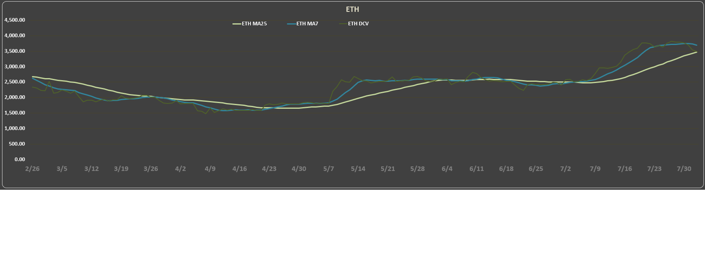
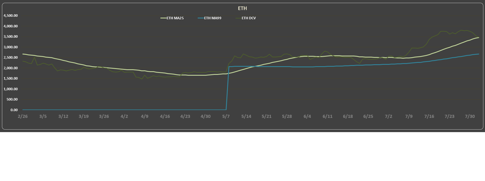
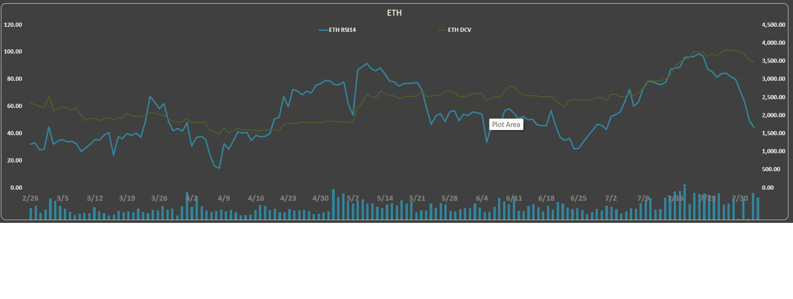
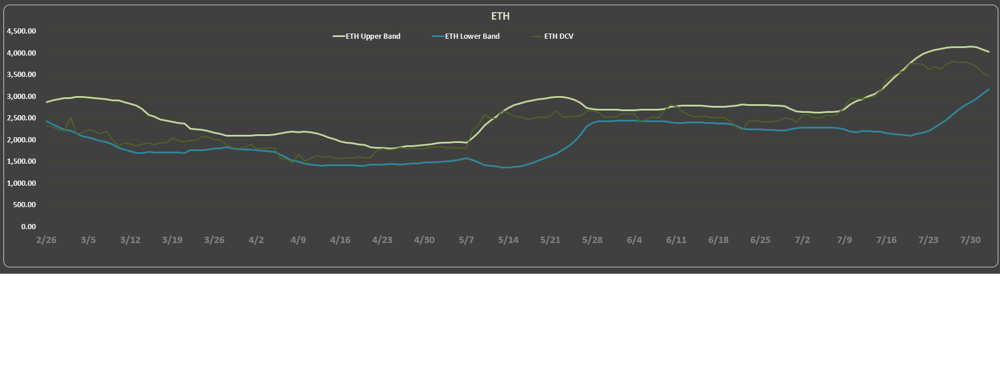
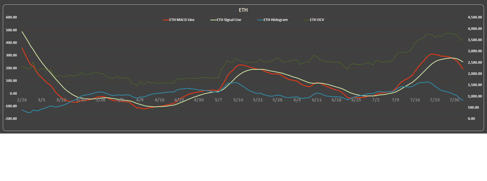
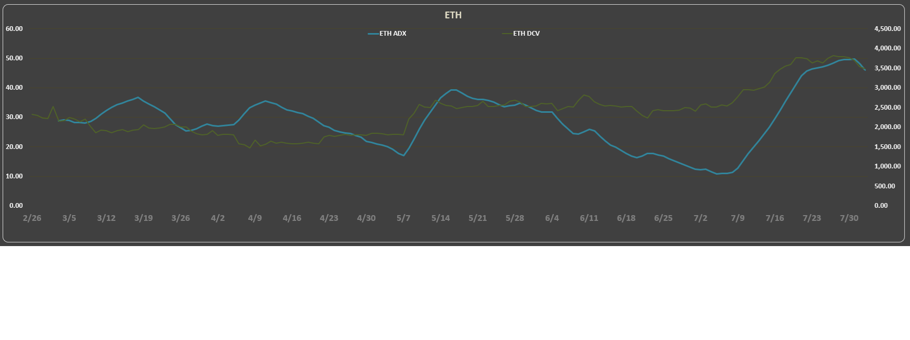
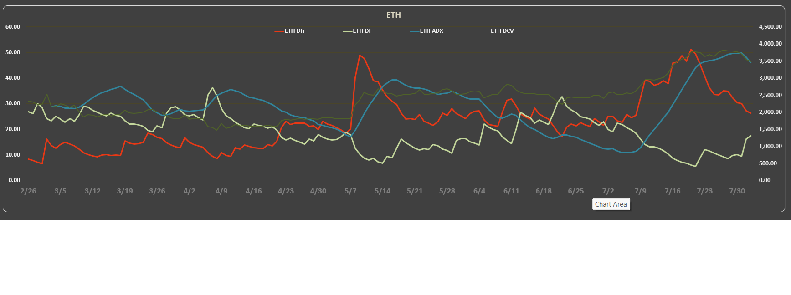

# 💡 Crypto Signal System

A hybrid trading analysis system that combines Python, Excel, and VBA to automatically generate technical analysis signals (RSI, MA crossovers, Volume trends) for top cryptocurrencies. Outputs include a dynamic Excel dashboard with backtest-ready charts.

---

## 🔍 Overview

This project automates the collection and analysis of cryptocurrency market data using a Python → Excel → VBA pipeline. The system fetches OHLCV data from Yahoo Finance, processes technical indicators in Excel (with macros and formulas), and generates:

* RSI (Relative Strength Index) analysis with threshold-based signals
* Moving Averages (MA7, MA25, MA99) and crossover detection
* Volume spikes and 3-day RSI volatility alerts
* A dynamic Excel dashboard for daily review or backtesting

> 📌 Currently supports up to 100 coins with 180-day history per coin.

---

## ✅ Features

* 🔄 Fully automated data pipeline (Yahoo Finance → Excel)
* 📉 RSI-based classification (Buy/Sell/Warning signals)
* �� MA crossover detection (Golden/Death Cross logic)
* 📊 Volume and 3-day RSI volatility signals
* 📈 Coin-wise dynamic dashboards with interactive charts
* 🗂️ Daily XLSM archive generation for historical tracking

---

## 🔁 System Flow

1. **Python Script** fetches OHLCV data for each coin from Yahoo Finance.
2. **Excel Macros** process RSI, Moving Averages, Volume, and Volatility metrics.
3. **Buy/Sell signals** are generated based on threshold rules.
4. **Dynamic Charts** are refreshed for each coin.
5. **Dashboard XLSM** is exported and archived daily.

---

## 📁 Folder Structure

```
crypto-signal-system/
├── scripts/                    # Python scripts for data fetching and signal generation
│   ├── coin_updater_debug.py
│   ├── generate_rsi_signals.py
│   └── archive_backup.py
├── excel_templates/
│   └── coin_data_template.xlsx
├── data/
│   └── coin_data_180days_top100.xlsx
├── archive/
│   └── (Daily XLSM exports)
├── README.md
├── LICENSE
└── requirements.txt
```

---

## 🚀 Getting Started

### 🔧 Requirements

* Python 3.10+
* Excel with macro support (.xlsm compatibility)
* Packages:

  * `openpyxl`
  * `pandas`
  * `tkinter` (for UI)

Install dependencies:

```bash
pip install -r requirements.txt
> ℹ️ Note: `tkinter` is included with most Python installations. If you experience issues, try installing `tk` via pip or consult your OS's Python GUI support.

```

### ▶️ Running the System

```bash
python main_controller.py
```

This will prompt a calendar input to select the date and trigger full pipeline:

* Data fetch
* Signal generation
* XLSM export

---

## 📷 Sample Output

## 📊 Technical Indicator Snapshots
### 📈 Moving Averages (MA7, MA25, MA99)


### 📊 RSI + DCV

### 📉 Bollinger Bands Snapshot

### 📊 MACD Histogram

### 📊 ADX Trend Strength

### 📊 DI+ / DI- Comparison

### 📋 Excel Dashboard Snapshot

---
## 👤 Author

**Muhammet Samkara**
GitHub: [@msamkara67](https://github.com/msamkara67)

---

## 🧪 License

This project is licensed under the MIT License.


