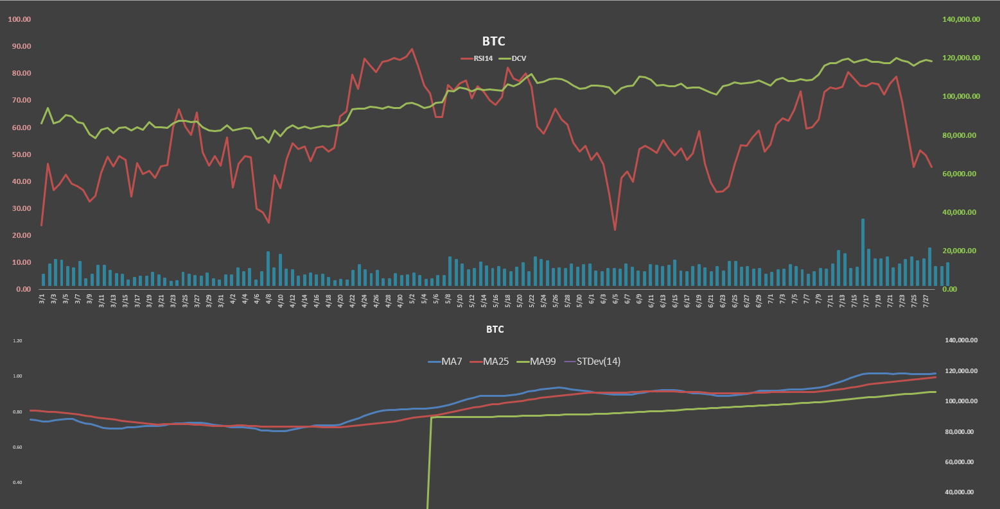
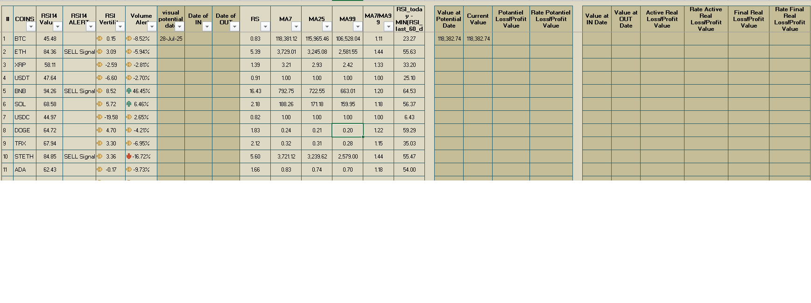
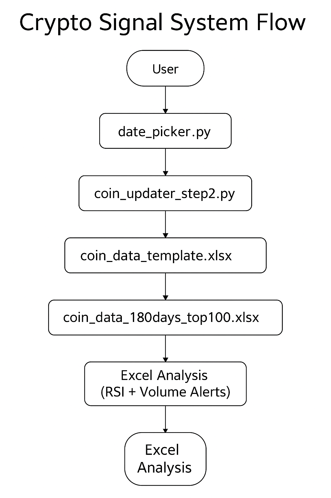

## 💡 Crypto Signal System

A Python + Excel + VBA hybrid system that automatically generates technical analysis charts and buy/sell signals for top cryptocurrencies using Green/Red RSI, Moving Averages, and Volume trends.

## 🔍 Overview

This project automates the collection, analysis, and visualization of crypto market data. It uses Python scripts to fetch live or historical data from Yahoo Finance, processes it through Excel, and finally produces:

* RSI, MA7, MA25, MA99 charts  
* Volume & Volatility trends  
* Automated Buy/Sell signal labeling

  
  

The final output is a polished Excel dashboard (with embedded macros and dynamic charts) ready for daily review or backtesting.

---

## ✅ Features

- Fully automated data update pipeline  
- RSI-based system with threshold classification  
- MA crossover detection (Golden/Death Cross)  
- Volume and volatility signals  
- Dynamic Excel dashboard per coin  
- Data archive system with daily XLSM exports  

---

## 🔁 System Flow

1. Python fetches raw OHLCV data from Yahoo Finance  
2. Excel macros and formulas calculate RSI, MA, and Volume metrics  
3. Buy/Sell signals and visual charts are updated per coin  
4. Output is archived with transparent charts + checkboxes  

---

## 📁 Folder Structure

